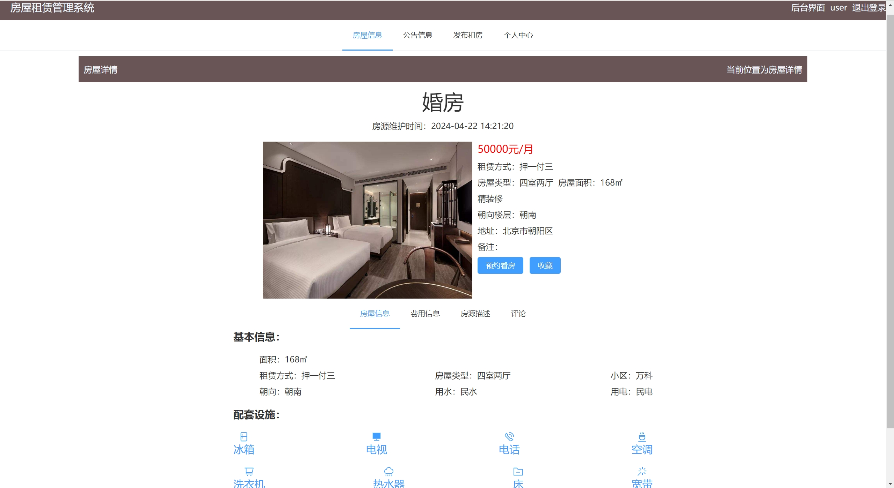
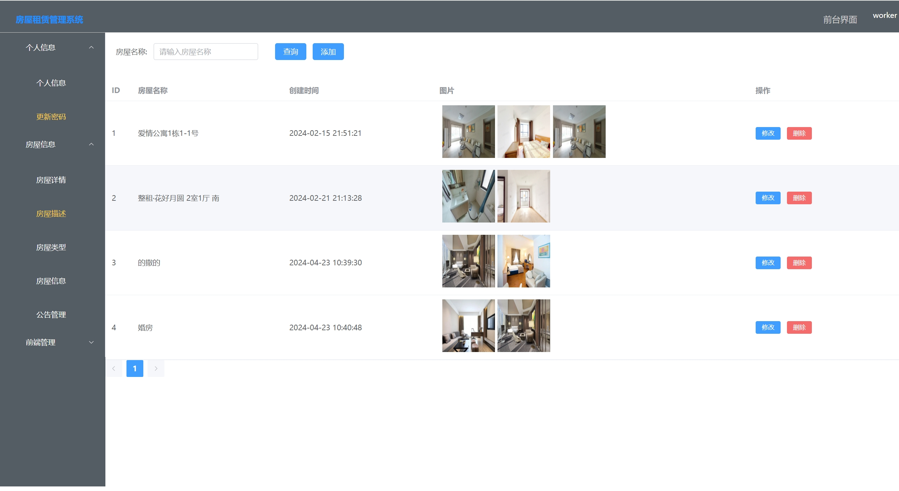

---
### 👉作者QQ ：1556708905 微信：zheng0123Long (支持修改、部署调试、定制毕设)

### 👉接网站建设、小程序、H5、APP、各种系统等

### 👉选题+开题报告+任务书+程序定制+安装调试+ppt 都可以做
---

**博客地址：
[https://blog.csdn.net/2303_76227485/article/details/138169148](https://blog.csdn.net/2303_76227485/article/details/138169148)**

**视频演示：
[https://www.bilibili.com/video/BV1vp421Q7sK/](https://www.bilibili.com/video/BV1vp421Q7sK/)**

**毕业设计所有选题地址：
[https://github.com/zhengjianzhong0107/allProject](https://github.com/zhengjianzhong0107/allProject)**

## 基于Java+Springboot+Vue的房屋租赁管理系统(源代码+数据库)136

## 一、系统介绍
本项目前后端分离，分为管理员、用户、工作人员、房东四种角色

### 1、用户/房东：
- 注册、登录、房屋浏览、预约看房、房屋收藏、轮播图、公告信息、发布租房、房屋评价、房屋信息、个人信息、我的预约、房屋预约
### 2、工作人员：
- 修改密码、房屋详情、房屋描述、房屋类型、房屋信息、公告管理、评论管理、房屋收藏管理、房屋预约管理
### 3、管理员：
- 工作人员的所有功能、用户管理、菜单管理、角色管理

## 二、所用技术

后端技术栈：

- Springboot
- MybatisPlus
- Mysql
- Maven
- Jwt

前端技术栈：

- Vue 
- Vue-router 
- axios 
- element-ui

## 三、环境介绍

基础环境:IDEA/eclipse, JDK1.8, Mysql5.7或以上, Maven3.6, node14, navicat

所有项目以及源代码本人均调试运行无问题 可支持远程调试运行

## 四、页面截图
### 1、用户/房东

### 2、工作人员：

### 3、管理员：

## 五、浏览地址
前台登录页面: http://localhost:8080/#/userhouse

- 用户账号/密码：user/123456

后台登录页面: http://localhost:8080

- 工作人员账号/密码：worker/123456
- 管理员账号/密码：admin/123456

## 六、部署教程

1. 使用Navicat或者其它工具，在mysql中创建对应名称的数据库，并执行项目的sql

2. 使用IDEA/Eclipse导入springboot项目，导入时，若为maven项目请选择maven; 等待依赖下载完成

3. 修改resources目录下面application.yml里面的数据库配置

4. src/main/java/com/example/DemoApplication.java启动后端

5. vscode或idea打开vue项目

6. 在编译器中打开terminal，执行npm install 依赖下载完成后执行 npm run serve,执行成功后会显示后台管理访问地址

